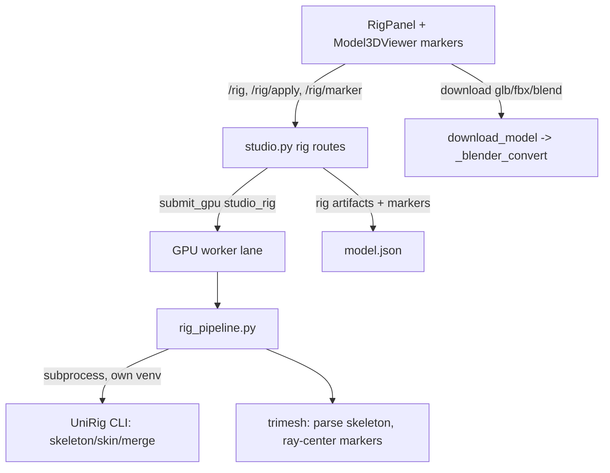

# Design: Step 3 — AI Rigging (UniRig) with positionable joint markers

Grounded in `.batman/ai-rigging-step/steering/understanding.md`. This is an **architecture change**
(new external dependency + new workflow stage). It needs sign-off on §2 before implementation.

## 1. Goal

A third step "Rigging" that: (a) auto-rigs the model mesh with UniRig, (b) surfaces 12 named joints
as markers the user repositions by clicking the mesh in the 3D viewer, (c) re-skins on demand, and
(d) exports a rigged GLB / FBX / .blend.

## 2. Architecture decision (NEEDS SIGN-OFF)

### Skeleton source of truth

**Option B1 — UniRig skeleton, mapped to markers (RECOMMENDED).**
Run UniRig's full pipeline (skeleton → skin → merge) to get a rigged mesh. Parse the predicted
skeleton; map a curated subset of its joints onto the 12 named markers by anatomical heuristics
(root/pelvis→groin, head→chin, the two arm chains→shoulder/elbow/hand, the two leg chains→
knee/ankle). The user edits those mapped joints; on "Apply", re-run UniRig **skin** on the edited
skeleton and re-merge.
- Pros: UniRig does what it's trained to do (its own skeleton topology + in-distribution skinning);
  best skin quality; robust across meshes.
- Cons: mapping UniRig joints → 12 named slots is heuristic and can mis-map on odd topologies;
  skeleton has more joints than the 12 (extra joints are kept in the rig but not all are editable).

**Option B2 — fixed 12-joint template, UniRig for skinning only.**
We define the 12-joint humanoid skeleton + parent hierarchy ourselves, initialize positions (UniRig
skeleton as a hint, or bbox proportions), let the user edit, then feed our skeleton FBX to UniRig
`generate_skin` + merge.
- Pros: predictable, fully-controlled skeleton that matches the named markers 1:1.
- Cons: a hand-built skeleton is out-of-distribution for UniRig's skin model → weights may be poor;
  more bespoke code; loses UniRig's main strength.

**Recommendation: B1.** It uses UniRig as designed and degrades gracefully; the 12 markers are an
editing convenience over UniRig's skeleton, not a replacement for it. Rest of this doc assumes B1.

### Secondary decisions (defaults, override at sign-off)
- **Marker "center"**: clicking the surface casts a ray through the mesh (trimesh, CPU) and places
  the joint at the **entry/exit midpoint** = the limb's center. Matches "based on their center".
- **Re-skin on edit**: edits are staged; a single **"Apply rig changes"** re-runs skin+merge (one
  GPU job) rather than re-skinning on every drag.
- **Mesh fed to UniRig**: the **textured** GLB if present (so the rigged export keeps the texture),
  else the shape GLB.
- **Non-humanoid meshes**: rigging still runs; if joint→marker mapping fails for a slot, that marker
  is omitted (rig still valid). Surfaced as a note, not an error.

## 3. Components



- **`webapp/rig_pipeline.py` (new)** — orchestrates UniRig: write input GLB, run the three UniRig
  scripts as subprocesses in the UniRig venv, then parse the rigged GLB skeleton (trimesh / glb
  node graph) → joint list; map joints → 12 named markers; return marker world positions + the
  rigged GLB path. Also: `recenter_marker(mesh, ray)` (trimesh ray through mesh → midpoint).
- **`webapp/server.py`** — `_unirig_run(stage, args)` helper mirroring `_blender_run`
  (env: `UNIRIG_DIR`, `UNIRIG_PYTHON`; 503/raise if absent; timeout; sentinel check).
- **`webapp/studio.py`** — `_gpu_rig` handler (+ `studio_rig` dispatch), rig artifact path helpers
  (`_rigged_glb`), `rig` persistence in `model.json` + `assemble_model`, and routes (§5).
- **Frontend** — `RigPanel.tsx` (new): run rig, joint list with select, "Apply rig changes", export.
  `model-3d-viewer.tsx`: render markers as hotspots, click-to-place the selected marker (raycast →
  backend recenter). `workflow-panel.tsx`: 3rd step. `lib/types.ts`/`api.ts`/`mock-backend.ts`.

## 4. Data model

`model.json` gains:
```jsonc
"rig": {
  "stage": "none|rigging|ready|reskinning",
  "markers": {                               // 12 entries; null until rigged / unmapped
    "groin":      { "pos": [x,y,z] } | null,
    "chin":       { "pos": [x,y,z] } | null,
    "shoulder-l": ..., "shoulder-r": ...,
    "elbow-l": ..., "elbow-r": ...,
    "hand-l": ..., "hand-r": ...,
    "knee-l": ..., "knee-r": ...,
    "ankle-l": ..., "ankle-r": ...
  },
  "rigged": "{id}_rigged.glb" | null,        // flat in OUTPUT_DIR, reuses /api/files + convert
  "updatedAt": 0
}
```
`Model` (types.ts) gains a matching optional `rig?: RigState`. Validation: marker keys ∈ the fixed
12-key set; positions are 3 finite floats; rigged path resolves inside `OUTPUT_DIR`.

## 5. API

- `POST /api/models/{id}/rig` → `Job` (400 if no mesh). Runs UniRig skeleton→skin→merge, parses
  joints, maps markers, writes `rig.rigged` + `rig.markers`, stage `ready`.
- `POST /api/models/{id}/rig/marker/{joint}` (JSON `{ ray: {origin:[..], dir:[..]} }` from the
  viewer raycast) → `Model`. CPU: trimesh ray through the rigged mesh → midpoint; updates that
  marker's `pos`. Joint ∈ the 12-key set (fail fast otherwise). No GPU.
- `POST /api/models/{id}/rig/apply` → `Job`. Rebuilds the skeleton FBX from current marker positions
  (move the mapped joints), re-runs UniRig `generate_skin` + `merge`, updates `rig.rigged`.
- `GET /api/models/{id}/download/{fmt}` — extend so when a rig exists it serves the **rigged** GLB
  (and FBX/.blend via `_blender_convert`, which preserves armature+skin). Falls back to textured/shape
  when no rig.

All camelCase JSON; jobs return the full `Model` on completion (existing convention).

## 6. Marker UX (frontend)

- Markers shown as `<model-viewer>` hotspots (small labeled dots) at each non-null `pos`.
- A joint list in `RigPanel` selects the active marker (highlighted). Clicking the model with a
  marker selected: `positionAndNormalFromPoint(px,py)` → surface point + camera position define a
  ray → `POST /rig/marker/{joint}` → backend returns the centered position → marker moves.
- Edits are local until "Apply rig changes" runs the re-skin job. A dirty indicator shows pending
  edits. `model-viewer.d.ts` extended with `positionAndNormalFromPoint`.

## 7. Environment / ops

- New env: `UNIRIG_DIR` (repo checkout), `UNIRIG_PYTHON` (its venv python), optional
  `UNIRIG_DEVICE`. `/api/health` gains `"unirig": <bool>` (dir + python exist). Setup documented in
  the webapp README: clone UniRig, create py3.11 venv, install per its instructions, first run
  auto-downloads weights from HF `VAST-AI/UniRig`.
- Runs on the single GPU worker lane (serialized with shape/paint). Timeouts generous (minutes).
- Failure is non-fatal to the model: a failed rig job leaves the mesh + texture intact, stage back
  to `none`, error on the job (mirrors `_gpu_base` revert).

## 8. Edge cases / risks
- UniRig missing → 503 with a clear message (mirrors Blender). Step 3 still renders, shows "rigging
  unavailable" with setup hint.
- Joint mapping miss → that marker omitted; rig still exported. Logged.
- Marker moved outside the mesh (ray misses) → keep previous position, surface a soft warning.
- Re-skin uses the **edited** skeleton so weights stay correct; if UniRig skin fails, keep the prior
  rigged GLB.
- Large meshes: UniRig expects reasonable poly counts; we already decimate at generate (`meshFaces`).

## 9. Verification
- Frontend: `tsc` clean; mock path exercises step 3 UX without a backend.
- Backend: code-path review; `_unirig_run`/`_blender_convert` 503 cleanly without the tools. Real
  run needs a GPU host with UniRig installed — documented manual check: rig a character mesh →
  markers appear → move a marker → Apply → rigged GLB updates → export FBX/.blend opens rigged in
  Blender.

## 10. Out of scope (this iteration)
- Animation/posing, IK, retargeting to Roblox R15 bone names, weight painting UI.
- Auto-running rig in the pipeline (user-initiated only).
