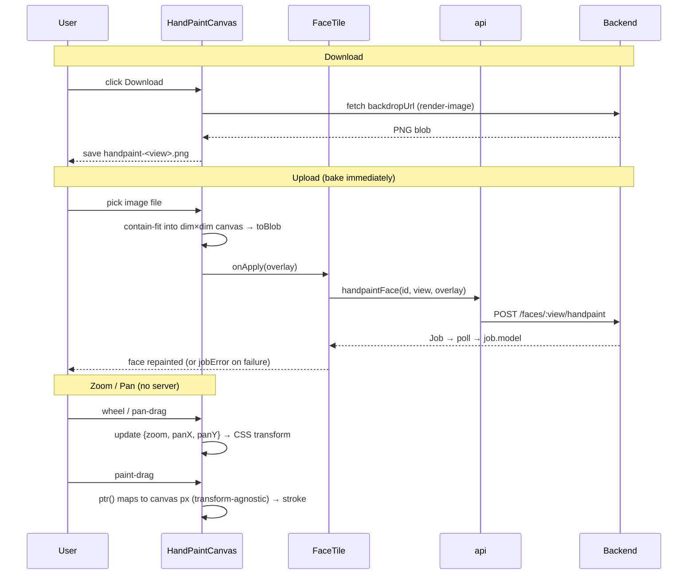

# Technical Design: Hand-paint view download/upload + zoom

## Document Information

- **Feature Name**: Hand-paint view download/upload + zoom
- **Version**: 1.0
- **Date**: 2026-06-19
- **Author**: Batman (with Jose)
- **Reviewers**: Jose
- **Related Documents**: `.batman/handpaint-upload-zoom/spec/requirements.md`,
  `.batman/handpaint-upload-zoom/steering/understanding.md`,
  `.batman/handpaint-upload-zoom/steering/constitution.md`

## Constitution Check

> Source of truth: `steering/constitution.md`. Checked before and after drafting.

| Principle | Status | Notes |
|---|---|---|
| 1. Frontend-Only, No Backend/Contract Change | ✅ Pass | Reuses `render` / `render-image` / `handpaint`. No new endpoint; `studio.py`/`pipeline.py`/`static/**` untouched. |
| 2. Reuse the Existing Bake Path | ✅ Pass | Upload composites to a `dim×dim` canvas → `toBlob` → existing `onApply` → `api.handpaintFace`. No new bake/camera code, no new api.ts method. |
| 3. Smallest Sufficient Diff | ✅ Pass | Edits `hand-paint-canvas.tsx` (primary) + one prop from `texture-panel.tsx`. No new deps. Reuses Button/lucide/Tailwind. |
| 4. Preserve Bake Fidelity Under Zoom | ✅ Pass | Zoom/pan are CSS transform only; buffer stays `dim×dim`; `toBlob` exports the full buffer; `ptr()` stays rect-based so mapping holds under transform. |
| 5. Fail Visibly, Degrade Safely | ✅ Pass | File-type guard; bake errors flow through existing `runJob`/`jobError` banner; controls disabled when no backdrop or busy. |

**Pre-design check:** 2026-06-19 — all 5 pass; no violations anticipated.
**Post-design check:** 2026-06-19 — all 5 still pass after drafting. Complexity Tracking empty.

### Complexity Tracking

| Violation | Principle violated | Why unavoidable | Mitigation |
|---|---|---|---|
| _(none)_ | — | — | — |

## Overview

Three UI additions to the existing `HandPaintCanvas` (rendered inside `FaceTile`'s `ImageDialog`):

1. **Download** — save the current backdrop PNG to disk.
2. **Upload** — pick an image; immediately composite it (contain-fit) into the `dim×dim` overlay
   buffer and bake it via the existing handpaint path.
3. **Zoom/Pan** — mouse-wheel zoom at cursor + drag-to-pan over the backdrop+canvas, with the brush
   still mapping to correct canvas pixels.

No backend, API, or `static/` change. The only non-UI step is rebuilding the Next.js export and
copying it into `webapp/webui/`.

### Design Goals
- Round-trip a face image through an external editor (download → edit → upload → bake).
- Repaint a whole face from an uploaded image in one click, reusing the validated bake.
- Paint fine detail via zoom, without ever reducing bake resolution or misregistering strokes.

### Key Design Decisions
- **Upload routes through `onApply`** (the same callback manual Apply uses) → zero new API surface and
  free error handling via `runJob`/`jobError`.
- **Zoom/pan via a single CSS-transformed wrapper** around the backdrop `` + `<canvas>`.
  Because `ptr()` derives canvas pixels from `canvas.getBoundingClientRect()` (which already reflects
  the on-screen transformed rect), brush mapping needs **no math change** — it works under scale+translate.
- **Pan gesture is distinct from paint**: pan on **middle-mouse drag**, or while the **Pan (hand)
  toggle** is active (then left-drag pans); otherwise plain left-drag paints. Plus a **Reset view**
  control. (Resolves the detail deferred from Understanding/Requirements; Space-hold dropped per user.)
- **Contain-fit upload** into an offscreen `dim×dim` canvas: a downloaded backdrop re-registers 1:1;
  arbitrary aspect ratios letterbox (transparent → bakes nothing) instead of distorting.

## Architecture

### System Context

```mermaid
graph TB
    User -->|wheel / drag / paint / upload / download| HPC[HandPaintCanvas]
    HPC -->|onApply(overlay Blob)| FT[FaceTile.applyHandpaint]
    FT -->|runJob| API[api.handpaintFace]
    API -->|POST /faces/:view/handpaint| BE[studio.py _gpu_handpaint → paint_overlay]
    HPC -->|GET /faces/:view/render-image| BE
    BE -->|job.model on complete| Provider[studio-provider updateModel]
```

### High-Level Flow (per feature)



### Technology Stack
| Layer | Technology | Rationale |
|-------|------------|-----------|
| UI | React 19 / Next.js 16 (static export) | Existing studio stack |
| Canvas | HTML5 Canvas 2D + CSS transform | Native, no deps; transform keeps `ptr()` mapping valid |
| Build | pnpm 10 / node 22 → `out/` → `webapp/webui/` | Existing deploy path |
| Backend | unchanged | Reuses render/handpaint endpoints |

## Components and Interfaces

### Component 1: HandPaintCanvas (modified — primary)

**Purpose**: The paint surface; gains upload, download, and zoom/pan.

**Responsibilities**:
- Render backdrop + brush canvas inside a zoom/pan transform wrapper.
- Wheel-zoom at cursor; pan via middle-mouse / Space-hold / Pan toggle; Reset view.
- Keep brush stroke mapping correct under transform (existing `ptr()` reused).
- Download the current backdrop PNG.
- On file upload, contain-fit into a `dim×dim` offscreen canvas and call `onApply(blob)`.

**Interfaces**:
- **Input (props)**:
  ```ts
  {
    backdropUrl: string | null
    refUrl: string | null
    onApply: (overlay: Blob) => void   // reused for manual Apply AND upload
    busy: boolean
    downloadName?: string              // NEW — e.g. "handpaint-front"; default "handpaint"
  }
  ```
- **Output**: an RGBA PNG Blob via `onApply` (manual or uploaded); a file save (download).
- **Dependencies**: `Button`, `Slider` (existing), lucide icons (`Upload`, `Download`, `Hand`,
  `Maximize`/`RotateCcw` for reset), existing `extractPalette`.

**New internal state**:
```ts
const [zoom, setZoom] = useState(1)            // 1 = fit, clamped [1, MAX_ZOOM]
const [pan, setPan]   = useState({ x: 0, y: 0 })// px, transform-origin top-left
const [panMode, setPanMode] = useState(false)  // Pan (hand) toggle
const uploadInput = useRef<HTMLInputElement>(null)
const viewportRef = useRef<HTMLDivElement>(null)// the fixed frame; wrapper inside is transformed
```

**Implementation notes**:
- **Wrapper transform**: inner wrapper (img + canvas) gets
  `style={{ transform: \`translate(${pan.x}px, ${pan.y}px) scale(${zoom})\`, transformOrigin: '0 0' }}`.
  The outer `viewportRef` frame keeps `overflow-hidden` and the existing `aspect-square` size.
- **Wheel zoom at cursor**: `onWheel` (preventDefault), compute `z2 = clamp(zoom * (1 - deltaY*k), 1, MAX)`;
  keep the world point under the cursor fixed:
  `world = (cursor - pan) / zoom; pan2 = cursor - world * z2`. `cursor` is relative to `viewportRef`.
- **Pan**: a pointer-down with `button===1` (middle mouse) or while `panMode` is on starts a pan
  drag (track deltas, update `pan`); otherwise it paints (existing `down/move/up`). Clamp `pan` so the
  scaled content can't be dragged fully out of the frame; at `zoom===1`, `pan` is forced to `{0,0}`
  (fit, centered).
- **`ptr()` unchanged**: it already divides by the canvas' transformed `getBoundingClientRect()`, so
  scaled+translated coordinates resolve to correct canvas pixels. No change needed for fidelity (P4).
- **Cursor**: `grab`/`grabbing` in pan mode/gesture, else `crosshair`.
- **Download**: `fetch(backdropUrl)` → blob → anchor `download = \`${downloadName}.png\``; revoke URL.
  Disabled when `!backdropUrl`.
- **Upload**: hidden `<input type="file" accept="image/*">`; on change, guard `file.type.startsWith('image/')`,
  load into `Image`, draw contain-fit onto an offscreen `dim×dim` canvas, `toBlob` → `onApply(blob)`.
  Disabled when `busy || !backdropUrl`.
- **Toolbar**: add Upload, Download, Pan toggle, Reset-view, and a small zoom readout near the
  existing Erase/Clear/Apply controls; keep current palette + brush-size rows.

### Component 2: FaceTile (modified — minimal)

**Purpose**: Hosts the canvas; supplies data and the bake callback.

**Change**: pass `downloadName={\`handpaint-${view}\`}` to `<HandPaintCanvas>`. `applyHandpaint`
(already the `onApply` handler) is reused verbatim for uploads — no new handler. No other change.

**Implementation notes**:
- `applyHandpaint` already closes the dialog and clears the backdrop on success, and `busy` already
  reflects `face.status === "texturing"`; uploads inherit all of this.

### Component 3: api / backend (unchanged)

No change. `api.faceRenderUrl` (download source), `api.handpaintFace` (bake), and `paint_overlay`
(server bake) already satisfy all three features.

## Data Models

The only new data is the canvas view state and the extended props (above). No persisted entity, no
DB, no schema. The overlay sent to the backend is unchanged in shape: an RGBA PNG sized to the
backdrop, baked where `alpha > 0.5`.

```ts
// View transform (client-only, ephemeral)
type ViewTransform = { zoom: number; pan: { x: number; y: number } }
const MAX_ZOOM = 6   // min is 1 (fit)
```

## API Design

No new or modified endpoints. Reused contract (for reference):

- `POST /api/models/:id/faces/:view/render` → `Job` (renders the backdrop)
- `GET  /api/models/:id/faces/:view/render-image` → `image/png` (the backdrop; also the download source)
- `POST /api/models/:id/faces/:view/handpaint` (multipart `overlay`: PNG) → `Job`
  - **400** if the model has no textured mesh → surfaced via `jobError`.

## Security Considerations

- **Input validation**: client guards that the upload is an image; the backend independently validates
  the PNG (`_save_upload_png` → `Image.verify()`) and the `view` allowlist (`_vview`) / id (`_vid`).
- **Path safety**: unchanged — the backend writes to `handpaint_<view>.png` under the model dir
  (existing, allowlisted). The client never sees disk paths.
- **No new surface**: no new endpoint, no new origin, no secrets. Download is a same-origin fetch of an
  already-served image.

## Error Handling

| Case | Handling |
|---|---|
| Non-image file selected | Ignored client-side; no bake started; input reset. |
| Bake fails (e.g. 400 no texture, network) | `runJob` catches the thrown `detail` → `jobError` banner; face unchanged. |
| Backdrop not ready | Download/Upload disabled until `backdropUrl` is set. |
| Busy (texturing) | Paint, Apply, Upload, Download, Clear disabled; existing `busy` spinner shown. |

No new error format; reuses the studio's `useJobRunner` error path.

## Performance Considerations

- Zoom/pan are pure CSS transforms on an already-loaded image + canvas — no re-fetch, no React
  re-render of pixels (only `zoom`/`pan` state changes; the canvas buffer is untouched).
- Upload resize is a single `drawImage` onto a `dim×dim` (≤1024²) offscreen canvas — sub-frame for
  typical inputs.
- Bake cost is unchanged (same overlay size as manual paint).

## Testing Strategy

- **No automated UI test harness exists** in the Next.js project (confirmed: only backend
  `test_studio_api.py` / `test_reference_views.py`). So:
  - **Build gate**: `pnpm build` must succeed (TypeScript errors are ignored by config, but the build
    must produce `out/`).
  - **Backend regression**: `python -m webapp.test_studio_api` stays green (proves no backend touch;
    it already covers the `handpaint` endpoint the upload reuses).
  - **Manual E2E** (documented in tasks):
    1. Download → file is the square face PNG; re-upload it → bakes with correct registration.
    2. Upload an edited backdrop → face visibly repaints after the job; a non-image is ignored.
    3. Zoom to ≥2× → a stroke lands under the cursor; pan reaches all edges; Reset returns to fit;
       Apply/Upload bake the full face regardless of zoom.
    4. Error: trigger handpaint on a model without texture (or simulate) → `jobError` shows, face
       unchanged.
- **Optional unit test** (only if low-cost and a runner is added): a pure `containFit(dim, w, h)`
  helper returning draw rect — extract it so it is unit-testable without a DOM. Not required for DoD.

## Migration and Compatibility

- **Backward compatible**: additive UI; no contract or persisted-state change. Existing manual hand
  paint, reface, AI paint, history/restore are untouched.
- **Deploy**: edit source → `pnpm build` → copy `out/*` into `webapp/webui/` (or point
  `HY3D_WEBUI_DIR` at `out/`). No server restart semantics change.

## Design Review Checklist

- [x] Architecture and component responsibilities defined
- [x] Addresses all functional requirements (R1 download, R2 upload-bake, R3 zoom/pan) + NFRs
- [x] Reuses existing patterns (onApply, runJob, Button/lucide/Tailwind); no new deps
- [x] Security: client + server input validation; no new surface
- [x] Error handling via existing jobError; controls disabled when unavailable
- [x] Constitution check passes (5/5), Complexity Tracking empty
- [x] Test strategy realistic for a project with no UI test harness (build gate + manual + backend regression)
- [x] Pan-vs-paint gesture resolved (middle-mouse / Space / Pan toggle; left-drag paints)
