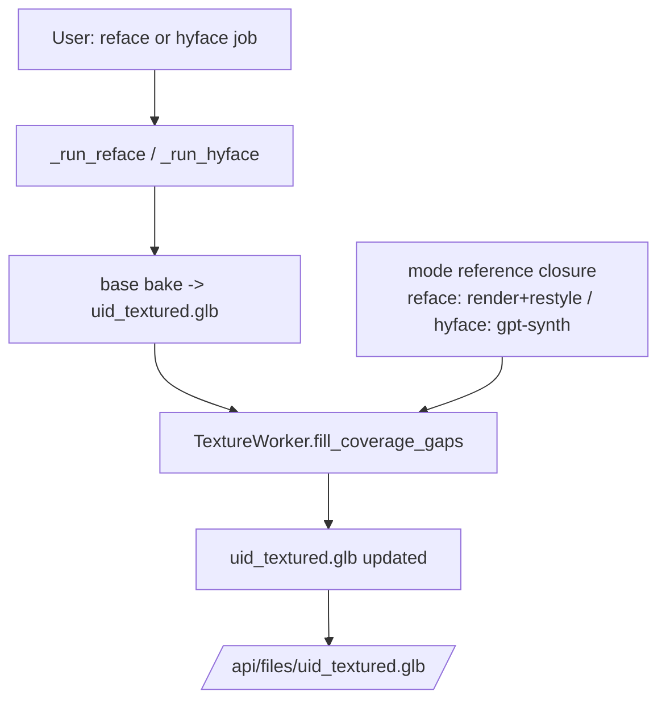
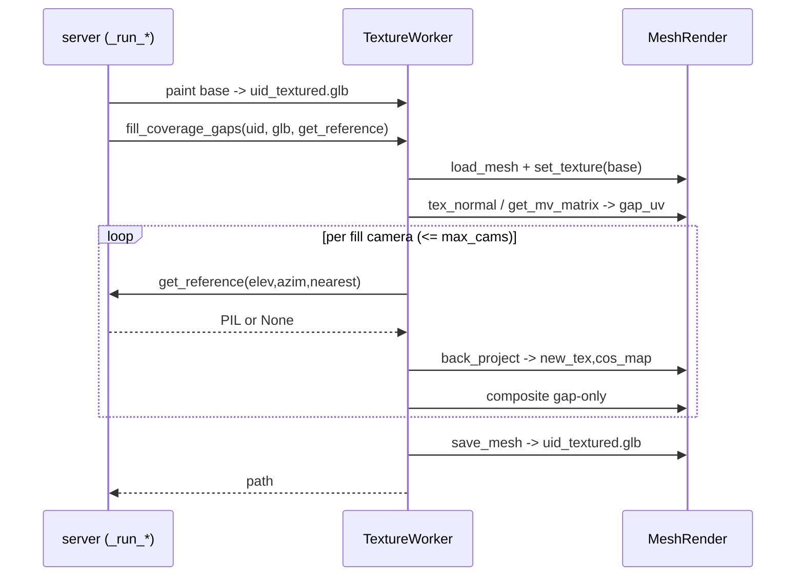

# Design — Oblique-Angle Coverage (auto gap-fill)

## Document Information
- Feature Name: Oblique-Angle Coverage (auto coverage-gap fill)
- Version: 1.0
- Date: 2026-06-17
- Author: Batman
- Reviewers: project owner
- Related: `.batman/oblique-angle-coverage/spec/requirements.md`, `steering/understanding.md`, `steering/constitution.md`

## Constitution Check

> Source of truth: `steering/constitution.md`. Checked pre-draft and post-draft.

| Principle | Status | Notes |
|---|---|---|
| 1. Additive, non-regressive | ✅ Pass | New `fill_coverage_gaps` method + two server closures + a default-on call appended to `_run_reface`/`_run_hyface`. No other `_run_*` touched. Reuses existing helpers without changing their signatures. |
| 2. Reuse renderer/bake primitives | ✅ Pass | Coverage via `get_mv_matrix` + `render.tex_normal`; bake via `back_project` + masked composite (the reface pattern); align via `_align_photo`/`_best_silhouette_fit`; refs via `render_textured_view`/`restyle_to_references`/`render_geometry_at`/`_openai_paint_view`. No new bake/UV math. |
| 3. Best-effort, non-fatal stage | ✅ Pass | The stage runs after the base GLB is written; wrapped in try/except that logs and returns the pre-gap GLB on any failure. The functional bake is already persisted before the stage runs. |
| 4. Bounded cost | ✅ Pass | Fixed 10 standard-camera coverage re-probes (no diffusion) + `GAPFILL_MAX_CAMS` hard cap on fill cameras + early-stop on low-yield/strikes; ref ladder is finite (gpt→gemini inside `edit_image`→nearest face→skip). No multiview UNet (projection bake only). |
| 5. Externalized, reversible config | ✅ Pass | `GAPFILL_*` env knobs (`os.environ.get` UPPER_SNAKE); per-mode enable default-on; off → byte-identical legacy path. |
| 6. Observability without secrets | ✅ Pass | One `[gapfill]` log line per run (gap count, cameras+angles, remaining) + `_set(job_id, message=...)`. No keys/secrets logged. |

**Pre-design check:** 2026-06-17 — all pass.
**Post-design check:** 2026-06-17 — all pass; no Complexity Tracking entries (no violations).

### Complexity Tracking
| Violation | Principle | Why unavoidable | Mitigation |
|---|---|---|---|
| (none) | — | — | — |

## Overview

Add ONE shared stage, `TextureWorker.fill_coverage_gaps`, that runs after the base
texture is baked in both `reface` and `hyface`. It reloads the just-written
textured GLB (preserving UVs + seeding the existing texture, exactly like `reface`),
finds mesh texels no standard view actually covered — grazed by the 75° bake gate OR
occluded behind another part (so they were left blank → inpaint-smeared), via a real
back_project coverage re-probe — then auto-selects a capped set of fill
cameras aimed at those normals, obtains a reference per camera (mode-specific
closure), and composites the back-projected paint ONLY onto the gap texels (+ a
small dilation). Default on; instantly reversible via env.

### Design Goals
- Cover oblique surfaces no standard view sees within 75°, in both modes.
- One uniform code path (a textured GLB in → a textured GLB out), reusing renderer
  + bake + reference primitives.
- Bounded, non-fatal, additive: zero impact on other modes and on failure.

### Key Design Decisions
- **Run as an auto-targeted reface on the reloaded GLB.** Both modes already end
  with a `{uid}_textured.glb`; gap-fill is conceptually "reface, but the system
  picks the cameras and the mask." Reloading (not threading state through
  `paint_faces`) keeps the stage uniform and decoupled, and matches how `reface`
  itself loads an existing textured mesh.
- **Gap detection = real coverage re-probe of the 10 standard views.** For each
  standard camera (6 cardinals + fl/fr/bl/br) call `back_project(dummy, elev, azim)`
  and read its `cos_map`; accumulate `trust += cos_map`. `covered = trust > eps`;
  `gap = valid & ~covered`. Because `back_project` applies BOTH the 75° cosine gate
  AND per-pixel rasterized visibility, this captures grazing-angle gaps AND
  occlusion gaps (a texel facing a camera but blocked by another part) in one reused
  primitive — strictly more accurate than an analytic normal dot-product, and uniform
  across reface/hyface (no dependence on the base texture's provenance). `tex_normal`
  is still used to rank fill cameras (below). Per-mode coverage set: reface uses the 10
  named views (its base came from an unknown prior mode); hyface uses the cameras it
  ACTUALLY painted (cardinals + tilts + corners + lows, from `view_specs`) so texels a
  tilt/low view already covered are not re-flagged as gaps.
- **Placement = greedy set-cover with REAL per-camera coverage.** Rank candidate
  (elev,azim) cameras by an analytic score (`cos(camera_lookat, tex_normal)` of the
  still-uncovered gap texels — ranking only). For each chosen camera, bake it and
  measure its ACTUAL newly-covered texels (`back_project` `cos_map>0 ∩ remaining_gap`,
  which respects occlusion); subtract those from `remaining_gap` and re-rank. Stop at
  `GAPFILL_MAX_CAMS` or when the best camera adds `< GAPFILL_MIN_TEXELS` real texels.
  Ranking is analytic (cheap); the loop converges on TRUE coverage, so a camera that
  looks good analytically but is occluded simply yields few real texels and the loop
  moves on. Avoids inverting normal→(elev,azim) (renderer elevation-flip convention).
- **Bake = projection (no diffusion).** Fill references are projected via
  `back_project` + UV-masked composite (the proven gptproject/reface path), so the
  stage needs no multiview UNet and no VRAM swap.

## Architecture

### System Context


### High-Level Flow
```mermaid
graph TD
    A[Reload textured GLB<br/>preserve UVs + seed base texture] --> B[Coverage re-probe<br/>back_project 10 standard cams -> trust]
    B -->|gap mask empty| Z[return base GLB unchanged]
    B -->|gaps found| C[Dilate gap mask UV]
    C --> D[Greedy set-cover, real per-camera coverage<br/>pick <= MAX_CAMS cameras]
    D --> E{for each fill camera}
    E --> F[get_reference_fn elev,azim,nearest_faces]
    F -->|None: skip| E
    F --> G[align to silhouette + refine]
    G --> H[back_project -> new_tex, cos_map]
    H --> I[composite: out[gap_dilated & cos>0 & alpha] = new_tex]
    I --> E
    E -->|done| J[set_texture + save_mesh + matte export]
    J --> K[updated uid_textured.glb]
```

### Technology Stack
| Layer | Technology | Rationale |
|-------|------------|-----------|
| Geometry/bake | hy3dpaint `MeshRender` (`back_project`, `tex_normal`, `get_mv_matrix`) | Existing, encodes camera/UV/mirror conventions |
| Reference (reface) | `render_textured_view` + `gen_transfer.restyle_to_references` | Existing reface path |
| Reference (hyface/no-ref) | `render_geometry_at` + `_openai_paint_view` (gpt-image-2 / Gemini) | Existing corner-fill path |
| Orchestration | `webapp/server.py` `_run_reface` / `_run_hyface` + `GAPFILL_*` env | Matches per-mode dispatch + knob conventions |

## Components and Interfaces

### Component 1: `TextureWorker.fill_coverage_gaps` (new, `webapp/pipeline.py`)

**Purpose**: Detect coverage gaps on a textured GLB and bake fill cameras onto only
the gap texels.

**Signature**:
```python
@torch.inference_mode()
def fill_coverage_gaps(
    self, uid: str, textured_glb_path: str, get_reference,
    standard_cams=None,            # list[(elev,azim)] used to DEFINE coverage (default = 10 named views)
    candidate_cams=None,           # list[(elev,azim)] camera CANDIDATES for fill (default = dense grid)
    max_cams: int = 6, dilation_px: int = 4,
    cos_thres_deg: float = 75.0, min_texels: int = 64,
) -> str:  # returns the (possibly updated) textured_glb_path
```
**Responsibilities**: reload mesh preserving UVs + seed base texture; compute gap UV
mask via a real back_project coverage re-probe of the standard cams (grazing +
occlusion); dilate; greedy-select fill cameras tracking real per-camera coverage; per
camera fetch+align+back_project+composite gap-only; save matte GLB. Non-fatal: any
internal error → return the input path unchanged.

**Interfaces**:
- Input: textured GLB path; `get_reference(elev, azim, nearest_faces) -> PIL|None`.
- Output: textured GLB path (same name, overwritten on success).
- Dependencies: `render.load_mesh`/`tex_normal`/`tex_grid`/`texture_indices`,
  `get_mv_matrix`, `back_project`, `_align_photo`, `_best_silhouette_fit`,
  `_extract_base_texture`, `_force_matte`.

**Implementation notes**:
- Coverage (real re-probe): `valid_uv = texture_indices >= 0` (H,W). `trust = 0`;
  for each standard cam: `_, cos_map, _ = back_project(dummy_rgba_ones, elev, azim)`;
  `trust += cos_map[...,0]`. `covered = trust > eps` (eps=1e-8). `gap_uv = valid_uv &
  ~covered`. This reuses `back_project`'s own cos gate + visibility, so no separate
  sign/convention assertion is needed (we read the renderer's output, not a hand
  dot-product). `diag_gapfill.py` asserts a known oblique face IS in `gap_uv` and a
  head-on face is NOT.
- Placement ranking uses `tex_normal` of remaining-gap texels vs each candidate
  camera's `lookat` (from `get_mv_matrix`, camera pos `cam = -w2c[:3,:3].T @
  w2c[:3,3]`) — ranking only; the chosen camera's REAL coverage comes from its bake
  `cos_map`. So a ranking sign error at worst reorders candidates; it cannot bake the
  wrong texels (the composite gate is the real `cos_map ∩ gap`).
- `gap_dilated = cv2.dilate(gap_uv.astype(uint8), kernel(dilation_px))` (write mask);
  `remaining_gap = gap_uv` (UNdilated, for real-coverage tracking).
- Greedy loop (per Key Decision): rank candidates by analytic score over
  `remaining_gap` normals; for the top candidate fetch the reference (skip on None,
  bounded attempts), bake it, compute `actual = remaining_gap & (cos_map[...,0]>1e-4)
  & (new_tex[...,3]>0.5)`; if `actual.sum() < min_texels` count a low-yield strike and
  try the next candidate (stop after 2 strikes or `max_cams` writes); else composite
  and `remaining_gap &= ~actual`, re-rank.
- Save (atomic): export the matte GLB to a TEMP path then `os.replace(tmp,
  textured_glb_path)`. The stage reads and writes the same path, so an in-place export
  that fails mid-write would corrupt the base bake; temp+replace keeps the base bake
  intact on any failure (honors the non-fatal guarantee).
- Composite per camera mirrors `reface` steps 4–5, gated by the dilated gap:
  `m = gap_dilated & (cos_map[...,0]>1e-4) & (new_tex[...,3]>0.5)`;
  `out[m] = new_tex[...,:3][m]`.

### Component 2: reface reference closure (new, in `webapp/server.py` `_run_reface`)

**Purpose**: Supply a per-camera reference for reface gap-fill.

**Logic**:
- IF the job has references → `render_textured_view(glb, elev, azim)` then
  `restyle_to_references(base_render, ref_paths)`.
- ELSE → the no-ref ladder (Component 4).

### Component 3: hyface reference closure (new, in `webapp/server.py` `_run_hyface`)

**Purpose**: Supply a per-camera reference for hyface gap-fill via the no-ref ladder
(it already has per-face refs to seed synth).

**Logic**: the ladder (Component 4), seeded by the nearest already-painted face refs.

### Component 4: reference ladder (shared helper, `webapp/server.py`)

```python
def _gap_reference(worker, shape_glb, elev, azim, nearest_face_imgs):
    # 1) gpt/gemini synth from geometry render at (elev,azim) + nearest faces
    if os.environ.get("OPENAI_API_KEY") and nearest_face_imgs:
        geom = worker.render_geometry_at(shape_glb, [("gap", elev, azim)])["gap"]
        return _prep_view(worker, _openai_paint_view(geom, nearest_face_imgs, "gap"),
                          remove_bg=True, flip=False)
    # 2) reuse nearest already-painted face image
    if nearest_face_imgs:
        return nearest_face_imgs[0]
    # 3) skip
    return None
```
`nearest_face` = the standard face whose lookat is closest to the camera's lookat.

### Component 5: Config (`webapp/server.py`, import-time)

```python
_GAPFILL_REFACE  = os.environ.get("GAPFILL_REFACE", "1").lower() not in ("0","false","no")
_GAPFILL_HYFACE  = os.environ.get("GAPFILL_HYFACE", "1").lower() not in ("0","false","no")
_GAPFILL_MAX_CAMS = int(os.environ.get("GAPFILL_MAX_CAMS", "6"))
_GAPFILL_DILATION = int(os.environ.get("GAPFILL_DILATION", "4"))
_GAPFILL_COS_DEG  = float(os.environ.get("GAPFILL_COS_DEG", "75"))
_GAPFILL_MIN_TEXELS = int(os.environ.get("GAPFILL_MIN_TEXELS", "64"))
# candidate fill grid (oblique angles the standard set lacks)
_GAPFILL_GRID_ELEVS = os.environ.get("GAPFILL_GRID_ELEVS", "-60,-30,0,30,60")
_GAPFILL_GRID_AZ_STEP = int(os.environ.get("GAPFILL_GRID_AZ_STEP", "30"))
```

## Data Models

Lightweight, in-memory only (no DB).

```python
# coverage inputs
N: FloatTensor          # (num_valid_texels, 3) world normals = render.tex_normal
grid: LongTensor        # (num_valid_texels, 2) texture pixel coords = render.tex_grid
gap_uv: BoolArray       # (H, W) True where a valid texel is uncovered (then dilated)
FillCamera = tuple      # (elev_deg, azim_deg)
```

### Data Flow


## API Design

No new HTTP endpoints. `/api/reface`, `/api/generate`, `/api/retexture` unchanged.
Behavior change is internal (an extra stage). Output contract unchanged:
`{uid}_textured.glb`, `textured_url=/api/files/{name}`, job `status/progress/message`.
Progress: add `message="Covering oblique gaps (N cameras)"` at ~progress 94.

## Security Considerations
- No new external input surface. `get_reference` only consumes existing job refs +
  rendered geometry.
- API keys read from env as today; never logged (Principle 6).
- Path/file handling reuses `OUTPUT_DIR` conventions (no caller-controlled paths).

## Error Handling
| Case | Behavior |
|---|---|
| No gaps (mask empty) | Return base GLB unchanged (no cost beyond coverage read). |
| `get_reference` returns None | Skip that camera; continue. |
| `get_reference` raises | Catch, log, skip that camera; continue. |
| Any stage error | Catch at the `_run_*` call site; keep the base GLB; job still completes. |
| No API key + no face refs | Ladder returns None → cameras skipped → gaps left to inpaint (no crash). |

Logging: `print(f"[gapfill] gaps={n0} cams={k} angles={...} remaining={n1}")`.

## Performance Considerations
- Coverage re-probe = 10 `back_project` passes (rasterize + project, no diffusion);
  greedy ranking is vectorized tensor ops over valid texels — sub-second.
- Cost = 10 coverage re-probes + up to `GAPFILL_MAX_CAMS` (reference fetch + bake)
  pairs. reface refs use one image-model call each; hyface synth one gpt call each.
  No multiview UNet.
- Empty-gap fast path = the 10 coverage re-probes then return (still no diffusion);
  if even cheaper is needed later, the standard cams can be cached per shape.
- Respect `low_vram_mode` → `torch.cuda.empty_cache()` at the end.

## Testing Strategy
- **Diagnostic probe** `webapp/diag_gapfill.py` (new): given a textured GLB, dump the
  gap mask PNG + gap-texel count, run `fill_coverage_gaps` with a stub reference fn
  (solid colour), dump the after count + result GLB. Confirms gap shrinkage and that
  only gap texels changed. Run on the screenshot model.
- **Unit-ish** (deterministic): greedy selection respects `max_cams` + `min_texels` +
  strike early-stop (pure ranking/loop logic with stubbed coverage counts); empty-gap
  early return; non-fatal fallback (reference fn raises → input path returned, texture
  unchanged). The coverage re-probe itself needs the renderer, so it is exercised by
  the probe/integration tests, not a pure unit test.
- **Integration**: reface end-to-end (with + without refs) and hyface end-to-end with
  the stage on; verify the oblique walls carry real colour (cos>0 there).
- **Regression**: `GAPFILL_*` off → reface/hyface output identical to pre-feature; a
  non-target mode (projection) output unchanged either way.

## Migration and Compatibility
- Backward compatible: default-on adds a stage; toggles revert exactly. No data
  migration. Output GLB schema unchanged.
- Integration impact: only `_run_reface` / `_run_hyface` gain a guarded trailing call;
  `pipeline.py` gains one method; `server.py` gains the ladder + closures + env knobs.

## Design Review Checklist
- [x] Architecture + components defined
- [x] Addresses R1–R8 + NFRs
- [x] Reuses existing patterns (Principle 2)
- [x] Error handling comprehensive + non-fatal (Principle 3)
- [x] Bounded cost (Principle 4)
- [x] Config externalized + reversible (Principle 5)
- [x] Observability included (Principle 6)
- [x] Test strategy covers unit/integration/regression + a probe
