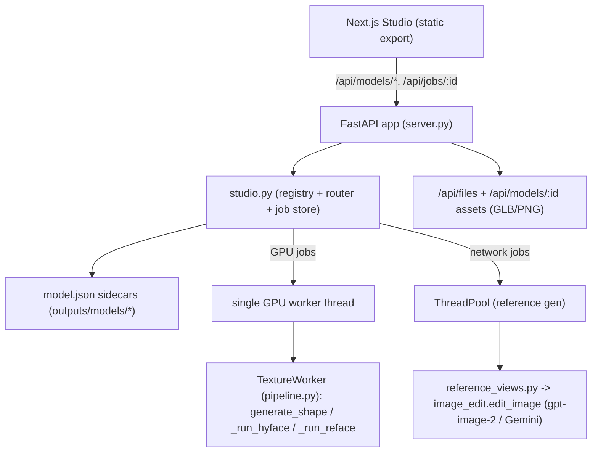
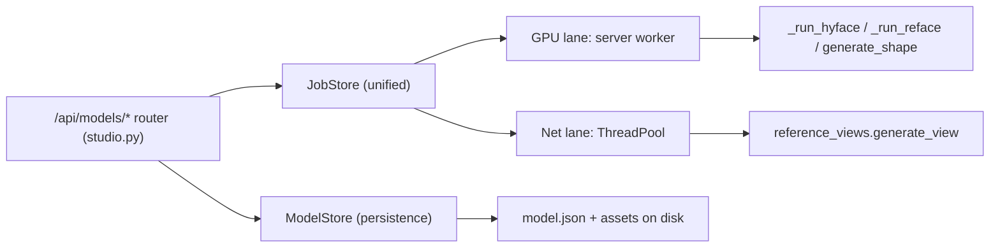
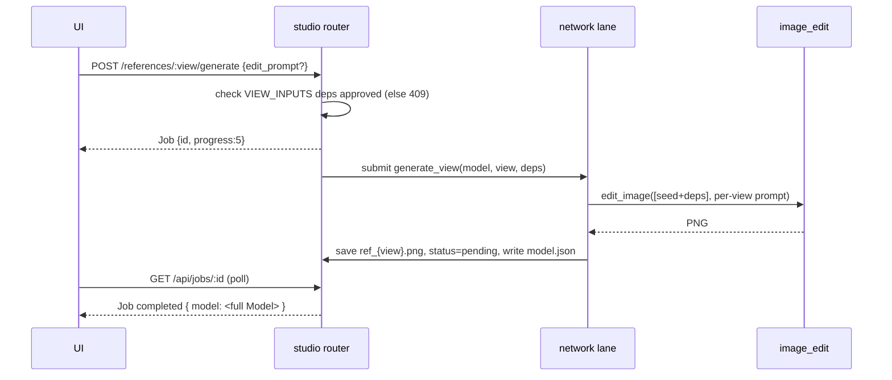

# Technical Design: Per-Model 3D Studio Backend

## Document Information

- **Feature Name**: Per-Model 3D Studio Backend
- **Version**: 1.0
- **Date**: 2026-06-18
- **Author**: Batman (with Josee)
- **Reviewers**: Project owner
- **Related Documents**: `steering/understanding.md`, `spec/requirements.md`, `steering/constitution.md`

## Constitution Check

> Source of truth: `.batman/per-model-studio-backend/steering/constitution.md`.

| Principle | Status | Notes |
|---|---|---|
| 1. Additive & Non-Regressive | ✅ Pass | New `studio.py`/`reference_views.py` layer; texturing reuses `_run_hyface`/`_run_reface` unchanged so kept-mode output is byte-equivalent. Removed modes deleted with their endpoints; shared helpers retained. |
| 2. Reuse Primitives | ✅ Pass | Base/reface adapt per-model requests into the existing internal job dicts and call `generate_shape`, `_run_hyface`, `_run_reface`; reference gen calls `edit_image`. No new bake/camera/image-call math. |
| 3. Best-Effort Never Destroys Work | ✅ Pass | Gap-fill stays inside `_run_hyface/_run_reface` (already non-fatal). `model.json` is written only after the functional artifact exists; fbx/blend convert and preview are best-effort. |
| 4. Durable, Path-Safe Source of Truth | ✅ Pass | `outputs/models/{id}/model.json` persists the aggregate; restart rebuilds via glob. `UUID_RE` for ids, view/format allowlists, `assert_within(OUTPUT_DIR)` for every resolved path; responses expose URLs only. |
| 5. Closed Vocabularies, Fail Fast | ✅ Pass | 10 view ids, 2 modes, 3 formats as closed sets; `VIEW_INPUTS` dependency enforced before generate (HTTP 409); unknown view/mode/format → 400. |
| 6. Job→Model Contract Integrity | ✅ Pass | `StudioJob` returns `id`+`progress` immediately, monotonic progress, embeds full `Model` on completion; failures set `error` and preserve prior artifacts. |
| 7. Separate GPU & Network Work | ✅ Pass | GPU jobs (shape/paint/reface) on the existing single worker thread; reference generation on a separate `ThreadPoolExecutor` network lane. |

**Pre-design check:** 2026-06-18 — all 7 pass; no violations.
**Post-design check:** 2026-06-18 — all 7 pass; Complexity Tracking empty.

### Complexity Tracking

| Violation | Principle violated | Why unavoidable | Mitigation |
|---|---|---|---|
| _(none)_ | — | — | — |

## Overview

Add a thin **per-model orchestration + persistence layer** on top of the existing webapp. Two new
modules — `webapp/studio.py` (registry, `Model` assembly, the `/api/models/*` router, unified job
store) and `webapp/reference_views.py` (staged mesh-free reference generation + per-view prompts) —
mount on the existing FastAPI app and reuse the existing GPU worker and `TextureWorker`. Per-model
state persists as a JSON sidecar per model. Reference generation runs on a separate network lane.
The built Next.js app is served same-origin by FastAPI. The five non-target texture modes are
removed.

### Design Goals

- Serve the exact frontend contract in `lib/api.ts` with a durable per-model aggregate.
- Maximize reuse of `_run_hyface`/`_run_reface`/`generate_shape`/`edit_image`; minimal change to
  `server.py`.
- Keep GPU work sequential; keep network-bound reference gen off the GPU lane.

### Key Design Decisions

- **Persistence**: per-model JSON sidecar (`outputs/models/{id}/model.json`) + per-model asset
  folder; model list rebuilt by globbing — durable, dependency-free, inspectable. (User-approved.)
- **Execution**: GPU lane = existing single worker thread (extended with studio job kinds); network
  lane = `ThreadPoolExecutor` for reference generation. (User-approved.)
- **Serving**: Next.js static export (`output: 'export'`) served by FastAPI `StaticFiles` at `/`.
  (User-approved.)
- **Code org**: new `webapp/studio.py` + `webapp/reference_views.py` mounted on the same app.
  (User-approved.)
- **Texture orchestration**: base = `generate_shape` then `_run_hyface` with `view_paths` = all
  approved references; reface = `_run_reface` with the view's approved reference. Reuse, don't
  reimplement.
- **Stage**: base completes → `textureStage:"complete"`, every painted face `done(mode:paint)`;
  reface/paint are optional edits. (User-approved.)

## Architecture

### System Context



### High-Level Architecture



### Technology Stack

| Layer | Technology | Rationale |
|-------|------------|-----------|
| Frontend | Next.js 16 static export | Same-origin relative `/api/*`; client SPA needs no SSR |
| Backend API | FastAPI + uvicorn (existing) | Already hosts the webapp; mount new router |
| GPU execution | Existing single worker thread | Serialize GPU; reuse `TextureWorker` |
| Network execution | `concurrent.futures.ThreadPoolExecutor` | Non-blocking gpt-image calls |
| Persistence | Per-model JSON sidecar + files | Durable, dependency-free, restart-safe |
| Image gen | `image_edit.edit_image` (gpt-image-2 / Gemini) | Existing, mesh-free capable |

## Components and Interfaces

### Component 1: `webapp/studio.py` — Registry + Router + Job Store

**Purpose**: Own the per-model aggregate, persistence, the `/api/models/*` + `/api/jobs/{id}` HTTP
surface, and the unified job store across both lanes.

**Responsibilities**:
- `ModelStore`: create/list/get/rename/delete; load/save `model.json`; assemble the `Model` JSON the
  frontend expects; map view↔angle; resolve+guard asset paths.
- `/api/models/*` and `/api/jobs/{id}` routes.
- `StudioJob` lifecycle: create (returns id+progress), update progress, complete (embed `Model`),
  fail (error + preserve artifacts).
- Submit GPU jobs to the existing worker (`WORK.put(("studio_*", job_id))`) and network jobs to the
  `ThreadPoolExecutor`.

**Interfaces**:
- **Input**: HTTP requests (multipart/JSON); internal calls from the GPU worker.
- **Output**: `Model`/`ModelSummary[]`/`Job` JSON; `model.json` writes; enqueued jobs.
- **Dependencies**: `server.py` (WORK queue, worker, `TextureWorker` instance, `_run_hyface`,
  `_run_reface`, `generate_shape`), `reference_views.py`, `image_edit` indirectly.

**Implementation Notes**:
- `StudioJob` dict matches the frontend `Job` shape exactly (`id,status,progress,label,error,model,
  modelId`). Stored in `STUDIO_JOBS` under a lock.
- GPU studio handlers build a legacy-compatible job dict (e.g. `view_paths` for hyface,
  `reface_src_glb`/`reference_paths` for reface) and call the existing `_run_hyface`/`_run_reface`
  so gap-fill, corners, and matte output are preserved unchanged.
- After any successful job, rebuild the `Model` from `model.json` + disk and set `job.model`.

### Component 2: `webapp/reference_views.py` — Staged Mesh-Free Reference Generation

**Purpose**: Generate the 10 orthographic reference views from the seed image along the imperative
dependency graph, with per-view prompts and tweak support.

**Responsibilities**:
- `VIEW_INPUTS` dependency graph (mirrors `lib/views.ts`).
- Per-view prompt builder (orthographic framing + rotation description + 3D cartoonish + "only this
  view's faces" + cross-view consistency rule), reusing `image_edit.CARTOON_STYLE`/`CONSISTENCY_RULE`
  and `gen_transfer.VIEW_SPEC`/`ADJ` vocabulary.
- `generate_view(model_dir, view, approved_inputs, seed_path, edit_prompt) -> png_path` via
  `edit_image(images=[seed + approved deps], prompt=..., prefer='openai')`.

**Interfaces**:
- **Input**: model id/dir, target view, paths of approved dependency views + seed, optional
  edit_prompt.
- **Output**: a generated PNG saved to the model's asset folder.
- **Dependencies**: `image_edit.edit_image`, `gen_transfer` constants.

**Implementation Notes**:
- Front ← seed only; cardinals ← front + seed; front corners ← front+left+right+top; back corners ←
  back+left+right+top. Images passed in dependency order (`images[0]` is the seed/front as the
  structural anchor where applicable).
- No mesh, no geometry render. Orthographic fidelity is prompt-enforced; include an optional
  horizontal-mirror sanity check for side views (reuse `gen_transfer._is_h_mirrored` if cheap).

### Component 3: `server.py` — Minimal Integration + Mode Removal

**Purpose**: Host the new router, expose reusable hooks, and remove non-target modes.

**Responsibilities**:
- `app.include_router(studio.router)`; mount the Next export at `/` (replace `static/`).
- Extend `_worker_loop` to dispatch `("studio_base"|"studio_reface"|"studio_face_edit", id)` to
  `studio` GPU handlers.
- Remove `_run_projection`, `_run_gpt_projection`, `_run_mvadapter`, `_run_mvgpt`/`_mv_texture`, the
  default-`hunyuan` fall-through, `POST /api/jobs/{id}/resume`, the `mvadapter` health flag and its
  import, and the mvgpt helper cluster. Default texture mode → `hyface`.
- Keep `image_edit.py`, `gen_transfer.py`, `blender_project.py`, `blender_convert.py`, `gpt_angles`
  field, and all `TextureWorker` methods.

**Implementation Notes**:
- Keep the legacy generate/texture/reface internals that `_run_hyface`/`_run_reface` rely on; only
  prune the removed modes and their unique helpers. Verify `/api/health` no longer imports
  `mvadapter_texture`.

## Data Models

### Frontend aggregate (served verbatim — `lib/types.ts`)

```typescript
type ViewId = "front"|"back"|"left"|"right"|"top"|"bottom"
  |"front-left"|"front-right"|"back-left"|"back-right"
interface ReferenceImage { view: ViewId; url: string|null;
  status: "empty"|"generating"|"pending"|"approved";
  source: "generated"|"uploaded"|null; editPrompt?: string|null; jobId?: string|null }
interface FaceState { view: ViewId; status: "pending"|"texturing"|"done";
  mode: "paint"|"reface"|null; jobId?: string|null }
interface Model { id: string; name: string; seedImageUrl: string|null;
  references: Record<ViewId, ReferenceImage>; faces: Record<ViewId, FaceState>;
  meshUrl: string|null; texturedUrl: string|null;
  textureStage: "none"|"base-running"|"base-done"|"refacing"|"complete";
  createdAt: number; updatedAt: number }
interface Job { id: string; status: "queued"|"processing"|"completed"|"failed";
  progress: number; label?: string; error?: string|null; model?: Model|null; modelId?: string }
interface ModelSummary { id: string; name: string; previewUrl: string|null;
  textured: boolean; updatedAt: number }
```

### Persistence — `outputs/models/{id}/model.json`

```jsonc
{
  "id": "uuid",
  "name": "string",
  "seed": "seed.png" | null,                       // relative to the model folder
  "references": { "<view>": { "status": "...", "source": "...", "file": "ref_front.png"|null,
                              "editPrompt": "string"|null } },   // 10 entries
  "faces": { "<view>": { "status": "...", "mode": "paint"|"reface"|null } },  // 10 entries
  "mesh": "{id}_shape.glb" | null,                 // flat in OUTPUT_DIR (reuses /api/files)
  "textured": "{id}_textured.glb" | null,
  "textureStage": "none|base-running|...|complete",
  "meshConfig": { "inferenceSteps": 30, "guidanceScale": 7.5, "octreeResolution": 256,
                  "textureViews": 6, "seed": 0, "meshFaces": 40000 },
  "createdAt": 0, "updatedAt": 0,
  "schemaVersion": 1
}
```

**Validation Rules**: `id` matches `UUID_RE`; view keys ∈ the 10-view set; status/mode/stage ∈ their
closed vocabularies; every file path resolves inside `OUTPUT_DIR`. Writes are atomic
(`tmp` + `os.replace`).

**Layout**: assets in `OUTPUT_DIR/models/{id}/` (`seed.png`, `ref_{view}.png`, `model.json`); GLBs
flat in `OUTPUT_DIR/{id}_shape.glb` + `{id}_textured.glb` (so `/api/files` + `TextureWorker`
flat-naming are reused with `uid = id`).

### Disk → URL mapping

| Asset | Disk | URL |
|---|---|---|
| Mesh GLB | `OUTPUT_DIR/{id}_shape.glb` | `/api/files/{id}_shape.glb` (existing) |
| Textured GLB | `OUTPUT_DIR/{id}_textured.glb` | `/api/files/{id}_textured.glb` (existing) |
| Seed image | `models/{id}/seed.png` | `/api/models/{id}/seed` (new) |
| Reference image | `models/{id}/ref_{view}.png` | `/api/models/{id}/references/{view}/image` (new) |

### Data Flow — generate a reference view



## API Design

All responses are camelCase JSON; errors carry `detail` or `error`. View path params use the
hyphenated `ViewId` (`front-left`), mapped internally to angle tags (`fl`).

### Models
- `GET /api/models` → `ModelSummary[]` (newest first).
- `POST /api/models` (multipart `name`, optional `seed_image`) → `Model`.
- `GET /api/models/{id}` → `Model` (404 if missing).
- `PATCH /api/models/{id}` (JSON `{name}`) → `Model`.
- `DELETE /api/models/{id}` → 204 (removes `models/{id}/` + `{id}_*.glb`).

### References
- `POST /api/models/{id}/references/{view}/generate` (JSON `{edit_prompt?}`) → `Job`
  (409 if deps unmet; 409 if already `generating`).
- `POST /api/models/{id}/references/{view}/upload` (multipart `image`) → `Model` (auto-approved).
- `POST /api/models/{id}/references/{view}/approve` → `Model` (400 if empty/generating).
- `GET /api/models/{id}/references/{view}/image` → PNG.
- `GET /api/models/{id}/seed` → PNG.

### Texture
- `POST /api/models/{id}/texture/base` (JSON `MeshConfig` snake_case) → `Job`
  (400 if not all 10 approved). GPU lane: `generate_shape` → `_run_hyface` (all approved refs) →
  populate `meshUrl`+`texturedUrl`, faces `done(paint)`, stage `complete`.
- `POST /api/models/{id}/texture/reface/{view}` (JSON `{edit_prompt?}`) → `Job`
  (400 if no textured mesh). GPU lane: `_run_reface` with that view's approved reference.
- `POST /api/models/{id}/faces/{view}/edit` (multipart `mode`, `edit_prompt?`, `image?`) → `Job`.
  `mode=reface` → `_run_reface`; `mode=paint` → **localized** single-face per-face paint: run the
  single-view Hunyuan paint for that face's camera (its approved reference, or `image` override),
  then composite onto the existing texture over that face's visible region (reuse the reface
  composite path with the painted view and a full visible-face mask, no depth-band restriction). It
  does NOT re-bake other faces. If `image` is provided, it overrides the stored approved reference.

### Jobs & Download
- `GET /api/jobs/{id}` → `Job` (embeds `model` when completed).
- `GET /api/models/{id}/download/{fmt}` (`glb|fbx|blend`) → file (reuse `blender_convert`; 400 bad
  fmt; 404 no model).

**Error responses**: `400` invalid input/vocabulary; `404` unknown model/job/asset; `409`
dependency/ordering violation. Body: `{ "detail": "..." }`.

## Security Considerations

- **Input validation**: `id` via `UUID_RE`; `view` via 10-view allowlist; `mode` via {paint,reface};
  `fmt` via {glb,fbx,blend}. Uploaded images parsed as untrusted (PIL load + re-encode to PNG).
- **Path safety**: every resolved path asserted inside `OUTPUT_DIR` (`assert_within`); model folders
  derived only from validated ids; no caller string concatenated into a path unchecked.
- **Secrets**: `OPENAI_API_KEY`/`GEMINI_API_KEY` never logged or returned; key-missing → clear,
  non-secret error.
- **Surface**: local single-user; CORS stays open; no auth (documented). Responses never include
  absolute disk paths.

## Error Handling

| Category | HTTP | Description | User Action |
|---|---|---|---|
| Validation | 400 | bad id/view/mode/fmt, empty approve | fix input |
| Ordering | 409 | unmet `VIEW_INPUTS` deps / already generating | approve deps first |
| Not Found | 404 | unknown model/job/asset | check id |
| Job failure | job.status=failed | generation/texture error (e.g. missing API key) | shown in JobBanner; retry |

- Async failures set `status:"failed"` + `error` and keep prior artifacts (P3, P6).
- Best-effort gap-fill / fbx-blend convert failures are logged and non-fatal.
- Structured logs for: job lifecycle, lane, view/mode, fallback to Gemini — no secrets.

## Performance Considerations

- One 16 GB GPU; GPU jobs strictly sequential. Per-model load: up to 10 sequential reference
  generations (network lane, may overlap with no GPU job) + 1 base (shape+paint) + optional refaces.
- Reference generation off the GPU lane so it never blocks shape/paint/reface.
- Progress updated frequently enough for the 700 ms client poll; monotonic non-decreasing.
- `STUDIO_JOBS` is in-memory (jobs are transient); models are durable on disk. Optional TTL/cap on
  finished jobs to bound memory (out of scope but noted).

## Testing Strategy

### Unit
- `reference_views`: per-view prompt builder includes orthographic + rotation + only-this-view +
  cartoonish; dependency-graph resolution picks the right inputs per view.
- `ModelStore`: model.json round-trip; view↔angle mapping; `assert_within` rejects traversal;
  closed-vocabulary validation.

### Integration (FastAPI `TestClient`, image gen + GPU mocked)
- Model CRUD + rename + **persistence across a simulated restart** (reload `ModelStore`).
- Staged generation gating: generating a cardinal before `front` approved → 409; corner before its
  deps → 409; approve rejects empty/generating.
- Job→Model: every async endpoint returns `id`+`progress`; completed job embeds full `Model`;
  failure sets `error` and preserves artifacts.
- Base: rejects unless all 10 approved; on success both `meshUrl`+`texturedUrl` set, faces
  `done(paint)`, stage `complete`.
- Reface: rejects without textured mesh; sets face `mode:reface`, stage stays `complete`.
- Mode removal: removed endpoints/modes → 404/400; `/api/health` imports cleanly.
- Download: glb served; fbx/blend route reachable (Blender mockable).

### End-to-End (gated, real keys + GPU)
- Full flow create → 10 refs → base → reface → edit → download glb/fbx/blend with
  `NEXT_PUBLIC_USE_MOCK=false`. Assert albedo-matte GLB and gap-fill still run.

## Deployment and Operations

- **Build**: `next build` with `output:'export'` → `out/`; FastAPI serves `out/` at `/`
  (replace the `static/` mount target; keep `/api/*` mounted before `/`).
- **Frontend config** (small, required): `next.config.mjs` already sets `images:{unoptimized:true}`;
  add `output:'export'` (one line) and set `NEXT_PUBLIC_USE_MOCK=false`. Verified export-safe: no
  `next/image`, no route handlers, no server actions/`cookies()`; `next/font/google` (Geist)
  self-hosts at build; `<model-viewer>` via `next/script` (unpkg) and `@vercel/analytics` (prod-gated,
  harmless self-hosted — optional to drop) both work in export. No component changes needed (base→
  complete works with the existing UI).
- **Run**: `python -m webapp.server --port 8080 --preload`; env `.env` provides
  `OPENAI_API_KEY`/`GEMINI_API_KEY`, `BLENDER_BIN`, `HY3D_OUTPUT_DIR`, tunables.
- **Rollback**: removed-mode deletion is a clean revert via git; persistence is additive (new files
  only); no data migration.

## Migration and Compatibility

- **Data migration**: none — net-new `models/` folder; existing `{uid}_*.glb` in `outputs/` are
  untouched (old gallery items simply aren't `Model`s; an optional one-time importer could wrap them,
  out of scope).
- **Backward compatibility**: the legacy `/api/generate`-style surface is superseded; the old static
  UI is retired by the Next export. Kept `TextureWorker`/helpers unchanged.
- **Integration impact**: only `server.py` (router mount, worker dispatch lines, mode removal) +
  the two new modules + the small `next.config` change.

---

## Design Review Checklist

- [x] High-level architecture + components + interfaces specified.
- [x] Addresses all functional requirements (R1–R13) and NFRs.
- [x] Security (path/input validation, secrets) addressed.
- [x] Error handling comprehensive; job→model contract pinned.
- [x] Data models complete (frontend aggregate + model.json schema).
- [x] API specs detailed for every endpoint.
- [x] Testing strategy covers unit/integration/E2E + persistence + mode removal.
- [x] Reuses existing patterns; loosely coupled new modules; config externalized.
- [x] Constitution Check passed pre- and post-design; Complexity Tracking empty.
